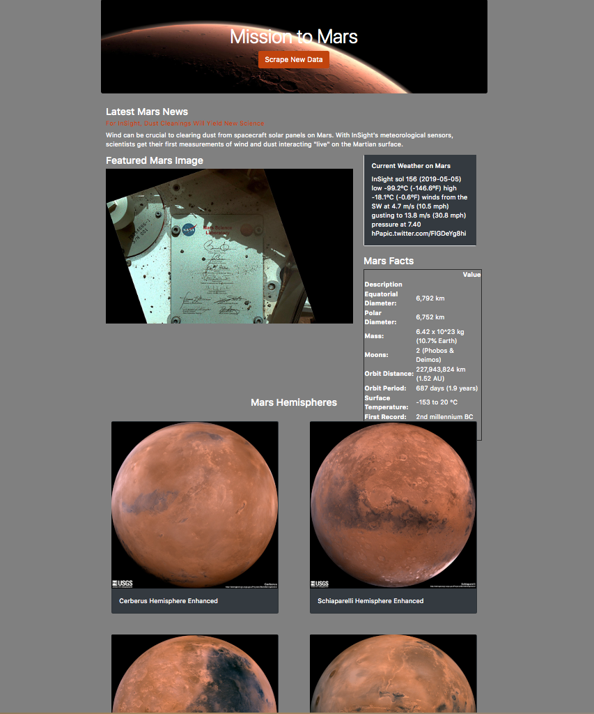

# Mission_to_Mars
Web scraping HW DataScience Bootcamp 

This assignment was to build a web application that scrapes various websites for data related to the Mission to Mars and displays the information in a single HTML page. 

## Scraping

Completed initial scraping using Jupyter Notebook, BeautifulSoup, Pandas, and Requests/Splinter.

* Created a Jupyter Notebook file called `mission_to_mars.ipynb` and used this to complete all of the scraping and analysis tasks. The following below outlines what was scraped.

### NASA Mars News

* Scraped the [NASA Mars News Site](https://mars.nasa.gov/news/) and collected the latest News Title and Paragraph Text.

### JPL Mars Space Images - Featured Image

* Visited the url for JPL Featured Space Image [here](https://www.jpl.nasa.gov/spaceimages/?search=&category=Mars).

* Used splinter to navigate the site and founnd the image url for the current Featured Mars Image and assigned the url string to a variable called `featured_image_url`.

### Mars Weather

* Visited the Mars Weather twitter account [here](https://twitter.com/marswxreport?lang=en) and scraped the latest Mars weather tweet from the page. Saved the tweet text for the weather report as a variable called `mars_weather`.

### Mars Facts

* Visited the Mars Facts webpage [here](https://space-facts.com/mars/) and used Pandas to scrape the table containing facts about the planet including Diameter, Mass, etc.

* Used Pandas to convert the data to a HTML table string.

### Mars Hemispheres

* Visited the USGS Astrogeology site [here](https://astrogeology.usgs.gov/search/results?q=hemisphere+enhanced&k1=target&v1=Mars) to obtain high resolution images for each of Mar's hemispheres.

* You will need to click each of the links to the hemispheres in order to find the image url to the full resolution image.

* Saved both the image url string for the full resolution hemisphere image, and the Hemisphere title containing the hemisphere name. Use a Python dictionary to store the data using the keys `img_url` and `title`.

* Appended the dictionary with the image url string and the hemisphere title to a list. This list will contain one dictionary for each hemisphere.

## MongoDB and Flask Application

Used MongoDB with Flask templating to create a new HTML page that displays all of the information that was scraped from the URLs above.

* Started by converting your Jupyter notebook into a Python script called `scrape_mars.py` with a function called `scrape` that will execute all of your scraping code from above and return one Python dictionary containing all of the scraped data.

* Next, created a route called `/scrape` that imports the `scrape_mars.py` script and call your `scrape` function.

* Run app.py in terminal to get web address then from host after scrape and     script will load from Mongodb 

  * Store the return value in Mongo as a Python dictionary.

* Create a root route `/` that will query your Mongo database and pass the mars data into an HTML template to display the data.

* Created a template HTML file called `index.html` that will take the mars data dictionary and display all of the data in the appropriate HTML elements. 

* Make sure Mongod is running and Run app.py in terminal to get web address then the scrape function should run after scrape the final product should display the nicely in web broswer as below.  

## Finished Product Screenshot

